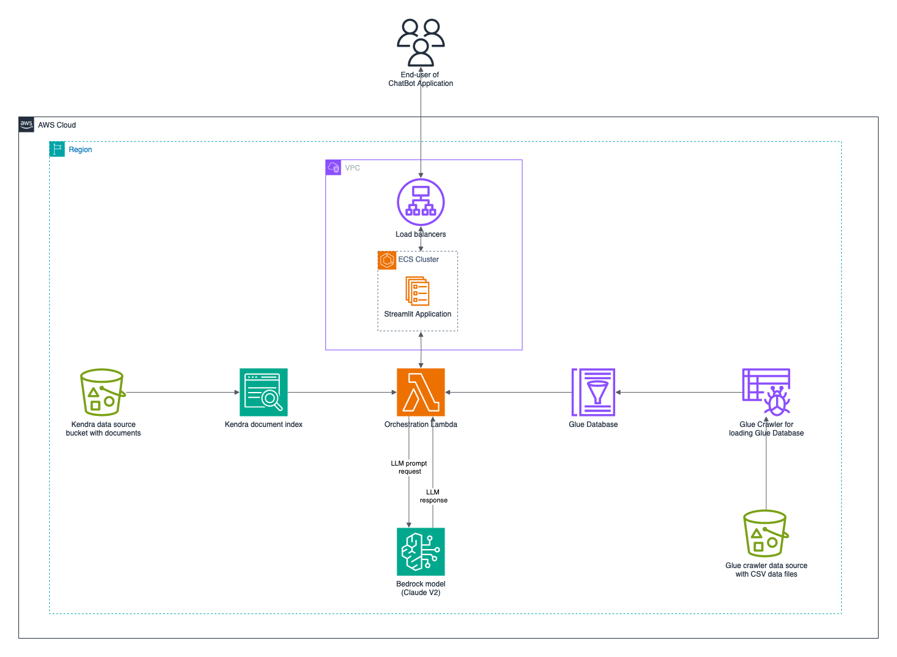

## GenAI ChatBot on AWS

### Introduction

This demo ChatBot application centers around the development of an advanced Chatbot using Amazon Bedrock and AWS's serverless GenAI solution. The solution demonstrates a Chatbot that utilizes the knowledge of the [Amazon SageMaker Developer Guide](https://docs.aws.amazon.com/sagemaker/latest/dg/gs.html?icmpid=docs_sagemaker_lp/index.html) and [SageMaker instance pricing](https://aws.amazon.com/sagemaker/pricing/). This Chatbot serves as an example of the power of Amazon Bedrock in processing and utilizing complex data sets, and it’s capability of converting natural language into Amazon Athena queries. It employs open source tools like LangChain and LLamaIndex to enhance its data processing and retrieval capabilities. The article also highlights the integration of various AWS resources, including Amazon S3 for storage, Amazon Kendra as vector store to support the retrieval augmented generation (RAG), AWS Glue for data preparation, Amazon Athena for efficient querying, Amazon Lambda for serverless computing, and Amazon ECS for container management. These resources collectively enable the Chatbot to effectively retrieve and manage content from documents and databases, illustrating the potential of Amazon Bedrock in sophisticated Chatbot applications.

### Prerequisites

- Docker
- AWS CDK Toolkit 2.132.1+, installed installed and configured. For more information, see [Getting started with the AWS CDK](https://docs.aws.amazon.com/cdk/v2/guide/getting_started.html) in the AWS CDK documentation.
- Python 3.11+, installed and configured. For more information, see Beginners Guide/Download in the Python documentation.
- An [active AWS account](https://docs.aws.amazon.com/accounts/latest/reference/manage-acct-creating.html)
- An [AWS account bootstrapped](https://docs.aws.amazon.com/cdk/v2/guide/bootstrapping.html) by using AWS CDK in us-east-1. The us-east-1 AWS Region is required for Amazon Bedrock Claude and Amazon Titan Embedding model access.
- Enable Claude and Titan embedding model access in Bedrock service.

### Target technology stack

- Amazon Bedrock
- Amazon ECS
- AWS Glue
- AWS Lambda
- Amazon S3
- Amazon Kendra
- Amazon Athena
- Elastic Load Balancer

### Target Architecture



### Code

The code repository contains the following files and folders:

- `assets` folder – The various static assets like architecture diagram, public dataset, etc are available here
- `code/lambda-container` folder– The Python code that is run in the Lambda function
- `code/streamlit-app` folder– The Python code that is run as the container image in ECS
- `tests` folder – The Python files that is run to unit test the AWS CDK constructs
- `code/code_stack.py` – The AWS CDK construct Python files used to create AWS resources
- `app.py` – The AWS CDK stack Python files used to deploy AWS resources in target AWS account
- `requirements.txt` – The list of all Python dependencies that must be installed for AWS CDK
- `requirements-dev.txt` – The list of all Python dependencies that must be installed for AWS CDK to run the unit test suite
- `cdk.json` – The input file to provide values required to spin up resources

**Note:** The AWS CDK code uses [L3 constructs](https://docs.aws.amazon.com/cdk/latest/guide/getting_started.html) and [AWS managed IAM policies](https://docs.aws.amazon.com/IAM/latest/UserGuide/access_policies_managed-vs-inline.html#aws-managed-policies) for deploying the solution.

### Deploy Code

The `cdk.json` file tells the CDK Toolkit how to execute your app.

This project is set up like a standard Python project. The initialization
process also creates a virtualenv within this project, stored under the `.venv`
directory. To create the virtualenv it assumes that there is a `python3`
(or `python` for Windows) executable in your path with access to the `venv`
package. If for any reason the automatic creation of the virtualenv fails,
you can create the virtualenv manually.

To manually create a virtualenv on MacOS and Linux:

```bash
python3 -m venv .venv
```

After the init process completes and the virtualenv is created, you can use the following
step to activate your virtualenv.

```bash
source .venv/bin/activate
```

If you are a Windows platform, you would activate the virtualenv like this:

```powershell
% .venv\Scripts\activate.bat
```

Once the virtualenv is activated, you can install the required dependencies.

```bash
pip install -r requirements.txt
```

At this point you can now synthesize the CloudFormation template for this code.

```bash
export CDK_DEFAULT_REGION=us-east-1
export CDK_DEFAULT_ACCOUNT=123456789
export CDK_ENVIRONMENT=dev
cdk synth
```

To add additional dependencies, for example other CDK libraries, just add
them to your `setup.py` file and rerun the `pip install -r requirements.txt`
command.

## Useful commands

- `cdk ls` list all stacks in the app
- `cdk synth` emits the synthesized CloudFormation template
- `cdk deploy` deploy this stack to your default AWS account/region
- `cdk diff` compare deployed stack with current state
- `cdk docs` open CDK documentation

## Security

See [CONTRIBUTING](CONTRIBUTING.md#security-issue-notifications) for more information.

## License

This library is licensed under the MIT-0 License. See the [LICENSE](LICENSE) file.
