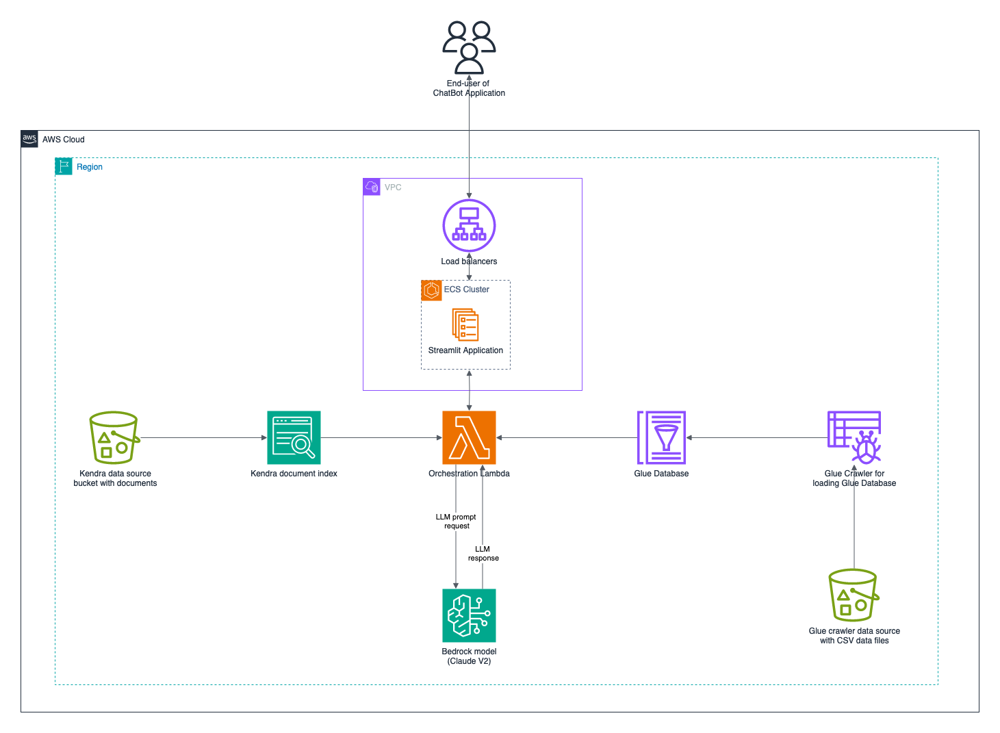

# GenAI Chat Assistant on AWS

## Introduction

This demo Chat Assistant application centers around the development of an advanced Chat Assistant using Amazon Bedrock and AWS's serverless GenAI solution. The solution demonstrates a Chat Assistant that utilizes the knowledge of the [Amazon SageMaker Developer Guide](https://docs.aws.amazon.com/sagemaker/latest/dg/gs.html?icmpid=docs_sagemaker_lp/index.html) and [SageMaker instance pricing](https://aws.amazon.com/sagemaker/pricing/). This Chat Assistant serves as an example of the power of Amazon Bedrock in processing and utilizing complex data sets, and its capability of converting natural language into Amazon Athena queries. It employs open source tools like LangChain and LlamaIndex to enhance its data processing and retrieval capabilities. The solution integrates various AWS resources, including Amazon S3 for storage, Amazon Kendra as vector store to support the retrieval augmented generation (RAG), AWS Glue for data preparation, Amazon Athena for efficient querying, Amazon Lambda for serverless computing, and Amazon ECS for container management. These resources collectively enable the Chat Assistant to effectively retrieve and manage content from documents and databases, illustrating the potential of Amazon Bedrock in sophisticated Chat Assistant applications.

### Models

The application uses the following Amazon Bedrock models via [global cross-region inference profiles](https://docs.aws.amazon.com/bedrock/latest/userguide/inference-profiles-support.html) for enhanced throughput and availability:

| Use Case | Model | Inference Profile ID |
|----------|-------|---------------------|
| Intent Classification | Claude Haiku 4.5 | `global.anthropic.claude-haiku-4-5-20251001-v1:0` |
| RAG & Agent | Claude Sonnet 5 | `global.anthropic.claude-sonnet-5` |
| SQL/Pricing Queries | Claude Sonnet 5 | `global.anthropic.claude-sonnet-5` |
| Embeddings | Cohere Embed v4 | `cohere.embed-v4:0` |

Claude Opus 4.8 (`global.anthropic.claude-opus-4-8`) is also wired up in
`Connections.MODELID_MAPPING` as `ClaudeOpus`. It is not used by default — pass
`model_name="ClaudeOpus"` to `Connections.get_bedrock_llm()` to opt in for a
given call path. Opus is substantially more expensive per token than Sonnet.

#### Sampling parameters

Claude Sonnet 5 and Claude Opus 4.8 have deprecated the sampling parameters
`temperature`, `top_p` and `top_k`. Sending any of them returns a
`ValidationException` on both `InvokeModel` and `Converse`. Claude Haiku 4.5
still accepts `temperature`, but rejects `temperature` and `top_p` together.

`Connections.get_bedrock_llm()` therefore sends `temperature` only for models
listed as supporting it, and never sends `top_p` or `top_k`. If you add a model
to `MODELID_MAPPING`, also update `Connections.MODELS_WITHOUT_SAMPLING_PARAMS`
so the correct parameters are sent.

#### Embeddings

Embeddings are generated with LangChain's `BedrockEmbeddings` wrapped in
LlamaIndex's `LangchainEmbedding` adapter. The `llama-index-embeddings-bedrock`
integration is deliberately not used: it accepts only a fixed allowlist of
model IDs and requires `aioboto3`, which pins `boto3` to an older release. The
wrapper accepts any Bedrock embedding model ID.

Changing the embedding model requires no reindexing. The table-retrieval index
used for pricing queries is built in memory on each Lambda cold start, and
document retrieval is handled by Amazon Kendra, which does not use this model.

### Deployment

Please refer to this APG article for detailed deployment steps:
[Develop advanced generative AI chat-based assistants by using RAG and ReAct prompting](https://docs.aws.amazon.com/prescriptive-guidance/latest/patterns/develop-advanced-generative-ai-chat-based-assistants-by-using-rag-and-react-prompting.html#develop-advanced-generative-ai-chat-based-assistants-by-using-rag-and-react-prompting-epics).

For a chat-assistant solution using Agents for Amazon Bedrock, please refer:

1. APG article: [Develop a fully automated chat-based assistant by using Amazon Bedrock agents and knowledge bases](https://docs.aws.amazon.com/prescriptive-guidance/latest/patterns/develop-a-fully-automated-chat-based-assistant-by-using-amazon-bedrock-agents-and-knowledge-bases.html)
2. Github Repo: [genai-bedrock-agent-chat-assistant](https://github.com/awslabs/genai-bedrock-agent-chat-assistant/)

### Prerequisites

- Docker
- AWS CDK Toolkit (CLI), installed and configured. Verified with CLI 2.1135.1 against `aws-cdk-lib` 2.264.0. For more information, see [Getting started with the AWS CDK](https://docs.aws.amazon.com/cdk/v2/guide/getting_started.html) in the AWS CDK documentation.
- Python 3.13+, installed and configured. For more information, see Beginners Guide/Download in the Python documentation.
- An [active AWS account](https://docs.aws.amazon.com/accounts/latest/reference/manage-acct-creating.html)
- An [AWS account bootstrapped](https://docs.aws.amazon.com/cdk/v2/guide/bootstrapping.html) by using AWS CDK in us-east-1.
- Enable Claude Haiku 4.5, Claude Sonnet 5, and Cohere Embed v4 model access in the [Amazon Bedrock console](https://console.aws.amazon.com/bedrock/).

### Post-deployment steps

`cdk deploy` creates the Kendra index and the Glue crawler but does not populate
them. Until both of the following complete, document questions return no
sources and pricing questions fail, because the Athena tables do not yet exist.

1. Sync the Kendra data source (indexes the SageMaker Developer Guide, ~1,400
   documents):

   ```bash
   INDEX_ID=$(aws kendra list-indices \
     --query 'IndexConfigurationSummaryItems[?contains(Name,`chat-assistant`)].Id | [0]' --output text)
   DS_ID=$(aws kendra list-data-sources --index-id "$INDEX_ID" \
     --query 'SummaryItems[0].Id' --output text)
   aws kendra start-data-source-sync-job --index-id "$INDEX_ID" --id "$DS_ID"
   ```

2. Run the Glue crawler (creates the four pricing tables):

   ```bash
   aws glue start-crawler --name chat-assistant-stack-sagemaker-pricing-crawler
   ```

Verify with `aws kendra describe-index --id "$INDEX_ID" --query
'IndexStatistics'` and `aws glue get-tables --database-name
chat-assistant-stack-pricing-db --query 'TableList[].Name'`.

You can then exercise the backend without the UI:

```bash
aws lambda invoke --function-name chat-assistant-stack-chat-lambda \
  --payload '{"body":"{\"query\": \"What is SageMaker Model Monitor?\", \"session_id\": \"1\"}"}' \
  --cli-binary-format raw-in-base64-out /dev/stdout
```

### Cost

This stack provisions continuously billed resources. The Amazon Kendra
Developer Edition index dominates the cost at roughly USD 810 per month and has
no free tier; two NAT gateways, the Fargate task and the Application Load
Balancer add roughly USD 140 per month. Expect on the order of USD 950 per month
while the stack is running, plus Bedrock token usage.

Every resource uses `RemovalPolicy.DESTROY`, so tear the stack down when you are
finished:

```bash
cdk destroy
```

The two S3 buckets are versioned and are not configured with
`auto_delete_objects`. If `cdk destroy` reports `DELETE_FAILED` on a bucket,
empty all object versions and delete markers, then re-run `cdk destroy`.

### Target technology stack

- Amazon Bedrock (Claude Haiku 4.5, Claude Sonnet 5, Cohere Embed v4)
- Amazon ECS
- AWS Glue
- AWS Lambda
- Amazon S3
- Amazon Kendra
- Amazon Athena
- Elastic Load Balancer

### Target Architecture



### Code

The code repository contains the following files and folders:

- `assets` folder – Static assets like architecture diagram, public dataset, etc.
- `code/lambda-container` folder – Python code for the Lambda function (LangChain, LlamaIndex, Bedrock integration)
- `code/streamlit-app` folder – Python code for the Streamlit container image running in ECS
- `tests` folder – Unit tests for the AWS CDK constructs
- `code/code_stack.py` – AWS CDK construct for creating all AWS resources
- `app.py` – AWS CDK stack entry point for deployment
- `requirements.txt` – Python dependencies for AWS CDK
- `requirements-dev.txt` – Python dependencies for running the unit test suite
- `cdk.json` – CDK configuration and context values

### Key Dependencies

| Component | Package | Version |
|-----------|---------|---------|
| Infrastructure | `aws-cdk-lib` | 2.264.0 |
| CDK rule pack | `cdk-nag` | >=2.38.2,<3.0.0 |
| LLM Integration | `langchain-aws` | 1.7.0 |
| LLM Framework | `langchain` | 1.3.15 |
| Agent Orchestration | `langgraph` | 1.2.11 |
| SQL Query Engine | `llama-index-core` | 0.14.23 |
| Bedrock LLM (LlamaIndex) | `llama-index-llms-bedrock-converse` | 0.14.18 |
| Embedding adapter | `llama-index-embeddings-langchain` | 0.5.0 |
| Frontend | `streamlit` | 1.61.1 |

`cdk-nag` is capped below 3.0.0 on purpose. Version 3.x removed
`NagSuppressions`, which both `app.py` and `code/code_stack.py` import.

**Note:** The AWS CDK code uses [L3 constructs](https://docs.aws.amazon.com/cdk/latest/guide/getting_started.html) and [AWS managed IAM policies](https://docs.aws.amazon.com/IAM/latest/UserGuide/access_policies_managed-vs-inline.html#aws-managed-policies) for deploying the solution.

## Running the tests

```bash
python3 -m venv .venv && source .venv/bin/activate
pip install -r requirements-dev.txt
python -m pytest -q -p no:debugging
```

`-p no:debugging` is required. The repository's `code/` package shadows the
Python standard library `code` module, which prevents pytest's debugging plugin
from importing `pdb` and aborts collection with an `INTERNALERROR`.

## Useful commands

- `cdk ls` list all stacks in the app
- `cdk synth` emits the synthesized CloudFormation template
- `cdk deploy` deploy this stack to your default AWS account/region
- `cdk diff` compare deployed stack with current state
- `cdk docs` open CDK documentation

## Security

The Streamlit UI is served by an **internet-facing Application Load Balancer over
plain HTTP on port 8080 with no authentication**. Anyone who can reach the ALB
DNS name can use the assistant and incur Bedrock charges on your account. This
is acceptable only for a short-lived demo in an isolated account.

Before using this beyond a demo, put authentication in front of the UI and
terminate TLS on the load balancer. Note that organisations commonly run
automated remediation that deletes unauthenticated public listeners, in which
case the UI becomes unreachable while the stack still reports a healthy
deployment; run the Streamlit app locally against the deployed Lambda in that
situation (see `code/streamlit-app/README.md`).

See [CONTRIBUTING](CONTRIBUTING.md#security-issue-notifications) for more information.

## License

This library is licensed under the MIT-0 License. See the [LICENSE](LICENSE) file.
