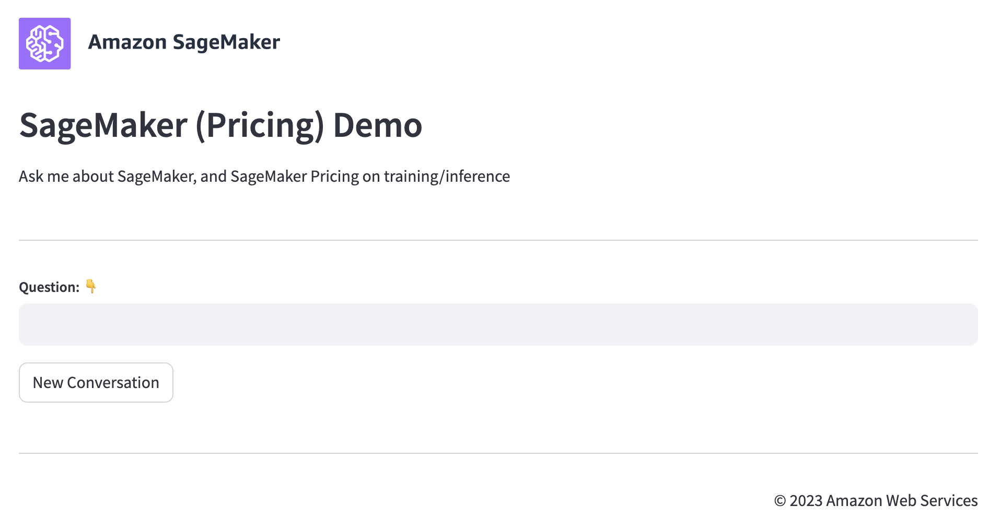

# Streamlit Frontend UI Application

## Introduction

This application is the frontend UI for the GenAI Chat Assistant powered by Amazon Bedrock. The application is deployed in Amazon ECS (AWS Fargate) with an Application Load Balancer on port 8080.

The UI holds no business logic of its own. It invokes the
`chat-assistant-stack-chat-lambda` function with `boto3` and renders the
`answer` and `source` fields it returns, so the UI can be run anywhere that has
credentials for that function.

## Component Details

#### Prerequisites

- All resources defined in the CDK stack deployed successfully
- Lambda function `chat-assistant-stack-chat-lambda` is running
- The Kendra data source sync and Glue crawler have completed (see the
  post-deployment steps in the root [README](../../README.md)); until they do,
  document questions return no sources and pricing questions fail

#### Technology stack

- [Streamlit](https://streamlit.io/) 1.61.1
- [Amazon ECS](https://aws.amazon.com/ecs/) (Fargate, ARM64)
- [Application Load Balancer](https://aws.amazon.com/elasticloadbalancing/application-load-balancer/) (port 8080)
- Python 3.13
- `boto3` 1.43.69

### Run Locally

Running locally is also the recommended way to use the UI when the load
balancer is unavailable. Only credentials for the deployed
Lambda are required; no inbound access to the stack is needed.

```bash
export LAMBDA_FUNCTION_NAME=chat-assistant-stack-chat-lambda
export AWS_REGION=us-east-1
export LOG_LEVEL=INFO
streamlit run app.py --server.runOnSave true --server.port 8501
```

The calling identity needs `lambda:InvokeFunction` on that function. Bedrock,
Kendra and Athena access are handled by the Lambda execution role, not by the
UI.

### User Interface


